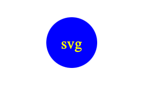

# challenge 10 (logo.svg generator)

## Description
By using your command line you can put in certain variables to create a svg logo that is either a triangle, cicrle, or a sqaure. You can put three characters inside the shape and change the color of the shape, as well as the color of the text in the middle
## Installation

N/A

## Usage
This would be used to easily create a simple 3 character logo 

Video link- https://youtu.be/znsngaJrUmI